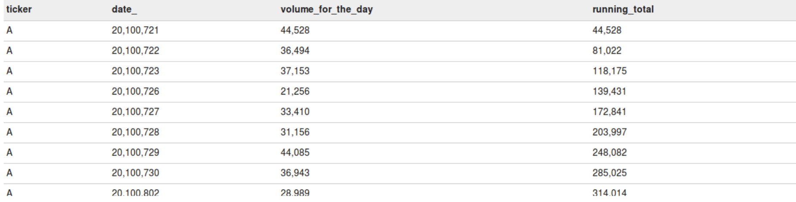
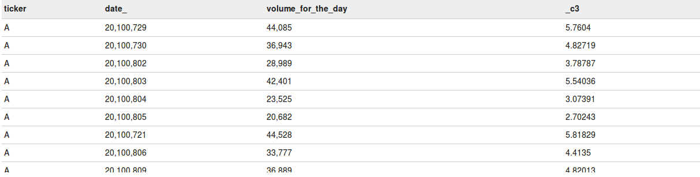

# Spark Interview

## Hands On

- **Question** Implement Wordcount in Spark?
  - Using Dataframe

    ```scala
    val df = sqlContext.read.text("README.md")
    val wordsDF = df.select(split(df("value")," ").alias("words"))
    val wordDF = wordsDF.select(explode(wordsDF("words")).alias("word"))
    val wordCountDF = wordDF.groupBy("word").count
    wordCountDF.orderBy(desc("count")).show(truncate=false)
    ```

  - Using RDD

    ```scala
    val textFile = sc.textFile("hdfs://...")
    val counts = textFile.flatMap(line => line.split(" "))
                     .map(word => (word, 1))
                     .reduceByKey(_ + _)
    counts.saveAsTextFile("hdfs://...")
    ```

  - PySpark

    ```python
    text_file = sc.textFile("hdfs://...")
    counts = text_file.flatMap(lambda line: line.split(" ")) \
                    .map(lambda word: (word, 1)) \
                    .reduceByKey(lambda a, b: a + b)
    counts.saveAsTextFile("hdfs://...")
    ```

    ```python
    from pyspark.sql import SparkSession
    spark = SparkSession.builder.appname("Word_Count").getOrCreate()
    file_path = "inputfile.txt"
    data = spark.read.text(file_path).rdd()
    count_words = data.flatMap(lambda x: x.split(" ")).map(lambda x: (x, 1)).reduceByKey(add)
    result = count_words.collect()
    for word, count in result:
        print(word, count)

    spark.stop()
    ```

- **Question** Wordcount+, provide the nth most occurring word and also the files it's part of.

  //Find the 2nd most frequent work and the files the word is part of
  /a001.txt - hi there
  /a002.txt - bye there
  /a003.txt - what there
  /a004.txt - hell
  /a005.txt - bye

    ```scala
    val textFile = sc.textFile("hdfs://...")
    val counts = textFile.flatMap(line => line.split(" "))
    .map(word => (word, 1))
    .reduceByKey(_ + _)
    counts.saveAsTextFile("hdfs://...")
    ```

    ```scala
    case class WordCount(count: Long, files: Set[String])
    import spark.implicits._
    val tempResult = spark.read.csv(fp).flatMap{l => 
    l.split(" ").groupBy().map((w,v) => w -> WordCount(v.length, Set(filename())))
    }.reduceByKey{(kv1, kv2) =>
    if(kv1._1 == kv2._1) List(kv1._1 -> WordCount((kv1._2.count + kv2._2.count), kv1._2.files.union(kv2._2.files)))
    else List(kv1, kv2)
    }.map(kv => (kv._1, kv._2.count, kv._2.files.toList)).toDF("w", "c", "f").sortBy($"c").take(2).lastOption.map(r => r.getAs[List[String]]("f"))
    ```

- **Question** Implement SCD Type 2 storage in Spark

- **Question** How to handle such delimited data with misplaced delimiters

  - |col1|,|col2|,"|co,l3|"

- **Question** Calculate # of sessions based upon following dataset. Assuming a single session is defined as consecutive activities by a user with difference < 3m b/w each.

    | SiteId | Userid | Time | Date | Activity Type |
    |---| --- | --- | --- | --- |
    | irctc | usr1 | 10:01 | 10-Mar | Click        |
    | irctc | usr1 | 10:03 | 10-Mar | Scroll       |
    | irctc | usr1 | 10:15 | 10-Mar | Scroll       |
    | irctc | usr2 | 10:01 | 10-Mar | Acknowledge  |
    | irctc | usr2 | 10:20 | 10-Mar | Click        |
    | irctc | usr3 | 10:15 | 10-Mar | Click        |
    | flpkrt | usr1 | 10:01 | 10-Mar | Click       |
    | flpkrt | usr1 | 10:33 | 10-Mar | Click       |
    | flpkrt | usr1 | 10:50 | 10-Mar | Acknowledge |
    | flpkrt | usr1 | 10:51 | 10-Mar | Acknowledge |
    | flpkrt | usr1 | 11:05 | 10-Mar | Acknowledge |
    | flpkrt | usr1 | 11:19 | 10-Mar | Acknowledge |
    | flpkrt | usr2 | 10:01 | 10-Mar | Scroll      |
    | flpkrt | usr2 | 10:10 | 10-Mar | Click       |
    | flpkrt | usr3 | 10:55 | 10-Mar | Scroll      |

    ****Answer****

    | SiteId | Date | Session Count |
    | irctc | 10-Mar | 5 |
    | flpkrt | 10-Mar | 8 |

  ```sql
      SELECT
      ipaddress, clicktime, SUM(IF(new_session, 1, 0)) OVER x + 1 AS sessionid
      FROM (
      SELECT
      ipaddress, clicktime, ts, ts - LAG(ts) OVER w > 1800 AS new_session
      FROM (
      SELECT 
      *, UNIX_TIMESTAMP(clicktime) AS ts
      FROM t_clickstream
      ) a
      WINDOW w AS (PARTITION BY ipaddress ORDER BY ts)
      ) b
      WINDOW x AS (PARTITION BY ipaddress ORDER BY ts);
  ```

- **Calculate 2 day moving average of each stock**

  ```sql
    SELECT
    `date`, `stock`, `close`
    ,AVG(`close`) OVER `w` AS `mavg`
    FROM `t_stock`
    WINDOW `w` AS (PARTITION BY `stock` ORDER BY `date`
    ROWS BETWEEN 1 PRECEDING AND CURRENT ROW)
  ```

- **Question** Get employee salary by manager

    Q) Give the list managers and his highest paid employee percentage
  - Tie breaker - If same salary then number skills
  - Tie Breaker - If same number of skills then Manager name

    Note:

    1) Employee Salary is sum of salA and salB
    2) Employee data of latest timestamp is the accurate data. previous data is invalid

    manager_json = [{
    "id" : "m1",
    "name": "Murali",
    "team_salary" : 500,
    "employees" : ["e1", "e2"]
    },

    {
    "id" : "m2",
    "name": "Aditya",
    "team_salary" : 400,
    "employees" : ["e1", "e2"]
    }

    ]

    employee_json = [{
    "id" : "e1",
    "salA" : 25,
    "salB" : 25,
    "timeStamp" : 1,
    "skills" : ["java", "python"]
    },

    {
    "id" : "e1",
    "salA" : 25,
    "salB" : 25,
    "timeStamp" : 3,
    "skills" : ["java", "python","spark"]
    },

    {
    "id" : "e2",
    "salA" : 25,
    "salB" : 25,
    "timeStamp" : 1,
    "skills" : ["java", "python"]
    }]

    Result should be in the exact same format as below

    manager_id  name    employee_id  salary skills
    m1          Murali      e1          90  "java,python,scala"
    m2          Aditya      e3          90  "java,python"

- **Question** Calculate Last 30 days moving average price of a product

    | store | Product | Price | Date |
    | --- | --- | --- | --- |
    | 1 | Paint | 30 | 12-Jan-2021 |
    | 1 | Paint | 35 | 30-Jan-2021 |
    | 1 | Paint | 60 | 30-Apr-2021 |

    Solution : PySpark

    ```python
    **days = lambda i: i * 86400 # 86400 seconds in a day 
    
    w0 = Window.partitionBy('name') 
    
    df.withColumn('unix_time',F.col('date').cast('timestamp').cast('long'))\    
     .withColumn('moving_avg', \        
     F.avg('price')\            
     .over(w0.orderBy(F.col('unix_time')).rangeBetween(-days(30), 0)\        
     )\    
    )\    
     .withColumn('days_since_last', \        
     F.datediff('date', F.lag('date', 1)\            
     .over(w0.orderBy(F.col('date')))\        
    )).show()**
    ```

- **Question** Perform trend analysis on product prices

    | Product | Date | Price |
    | --- | --- | --- |
    | Paint | 01-Jan-2021 | 30 |
    | Paint | 02-Jan-2021 | 35 |
    | Paint | 03-Jan-2021 | 20 |

    **Expected Output**

    | Product | Date | Price | Trent |
    | --- | --- | --- | --- |
    | Paint | 01-Jan-2021 | 30 | NA |
    | Paint | 02-Jan-2021 | 35 | Up |
    | Paint | 03-Jan-2021 | 20 | Down |

    Solution : PySpark

    ```python
    from pyspark.sql.window import Window
    import pyspark.sql.functions as F
    
    wd = Window.partitionBy('empname').orderBy(F.col('saldt_parse').asc())
    
    csvdf2.withColumn(\
        'trend',  \
             F.when(\
                 (F.col('salary') - F.coalesce(F.lag('salary', 1).over(wd), F.lit(0))) > 0, 'UP')\
             .otherwise('DOWN')
    )\
    .withColumn(\
        'diff',  \
                (F.col('salary') - F.coalesce(F.lag('salary', 1).over(wd), F.lit(0)))\
    ).show()
    ```

- **Calculate running total of sales volume for a product over multiple days**

  ```sql
  select prod_id, sale_date, day_vol, SUM(day_vol) OVER(PARTITION BY prod_id ORDER BY sale_date) AS sales_running_total FROM sales_table
  ```

  ```sql
  select ticker,date_,volume_for_the_day,sum(volume_for_the_day) over(partition by ticker order by date_) as running_total from acadgild.stocks
  ```

  

- **Calculate percentage of a day's sales volume of the total sales volume for the production over multiple days**

  ```sql
  select prod_id, sale_date, day_vol, ((day_vol*100)/SUM(day_vol) OVER(PARTITION BY prod_id)) AS perc_over_sale FROM sales_tbl
  ```

  

## Theoretical

- ****Scenario**** : If we have lot of partitions with varying number of small files and varying data size. How will we write a compaction logic to repartition the data in proper sized chunks.

- ****Scenario**** : You have been given 2 tables in HIVE and asked to validate if the 2 datasets are equal or not e.g. doing a UAT against PROD data. Implement this request in Spark.

- **Question** B/w Spark and MR/HIVE, which will perform better for word-count use-case
  - The main reasons stem from the fact that, usually, one does not run a single MapReduce job, but rather a set of jobs in sequence.
    - One of the main limitations of MapReduce is that it persists the full dataset to HDFS after running each job.  This is very expensive, because it incurs both three times (for replication) the size of the dataset in disk I/O and a similar amount of network I/O.  Spark takes a more holistic view of a pipeline of operations.  When the output of an operation needs to be fed into another operation, Spark passes the data directly without writing to persistent storage.  This is an innovation over MapReduce that came from Microsoft's Dryad paper, and is not original to Spark.
    - The main innovation of Spark was to introduce an in-memory caching abstraction.  This makes Spark ideal for workloads where multiple operations access the same input data.  Users can instruct Spark to cache input data sets in memory, so they don't need to be read from disk for each operation.
    - What about Spark jobs that would boil down to a single MapReduce job?  In many cases also these run faster on Spark than on MapReduce.  The primary advantage Spark has here is that it can launch tasks much faster.  MapReduce starts a new JVM for each task, which can take seconds with loading JARs, JITing, parsing configuration XML, etc.  Spark keeps an executor JVM running on each node, so launching a task is simply a matter of making an RPC to it and passing a Runnable to a thread pool, which takes in the single digits of milliseconds.
    - Lastly, a common misconception probably worth mentioning is that Spark somehow runs entirely in memory while MapReduce does not.  This is simply not the case.  Spark's shuffle implementation works very similarly to MapReduce's: each record is serialized and written out to disk on the map side and then fetched and deserialized on the reduce side.

- **Question** Explain lifecycle of a Spark job using word-count as an example. Different cluster components interacted with etc.
  - Driver - The process running the main() function of the application and creating the SparkContext
    - The driver contacts the cluster manager for the allocation of resources and also requests cluster mgr to launch the executors
  - Cluster Manager - Allocates resources as requested by Driver for execution. Calls on Workers to start Executor processes
  - Worker - Process running on nodes, which reports the available resources to the master and helps to create Executor for actual task processing
    - The Driver program coordinates the tasks run on worker nodes through the SparkContext
    - When we first submit the program via spark-submit, SparkContext identifies the cluster manager based upon passed parameter e.g. yarn, mesos, local, kubernetes and establishes connection to it
    - Next SparkContext negotiates resources with the clusters Resource manager and get's the Executor processes started on the worker nodes
    - Next it sends the application code (jar, python files etc.) to each of the Executors
    - Finally SparkContext sends the tasks to the executors to run
    - At all time during the execution of an application, the driver program must be accessible and communication with all the Executors
    - Executors can communicate with each other across multiple Worker nodes
    - The cache is shared between all the tasks for a single executor

- **Question** Explain about some optimization scenarios you have worked upon in Spark
  - Dynamic Allocation of executors
  - Checkpointing to avoid recompute of lineage - cache() / persist()
  - `spark.cores.max`
  - `spark.executor.cores` (`--executor-cores`  > per executor number of cores)
  - `spark.executore.memory` (`--executor-memory`)
  - `--total-executor-cores` (max numbers of executor cores per application)
  - `spark.driver.memory` (cluster) / `spark.yarn.am.memory` (client)
  - `spark.driver.cores` (cluster) / `spark.yarn.am.cores` (client)

spark.executor.instances (--num-executor   ->  deprecated now due to dynamic allocation)

- **Question** Narrow vs Wide Transformations
  - **Narrow transformation —** In *Narrow transformation*, all the elements that are required to compute the records in single
    partition live in the single partition of parent RDD. A limited subset
    of partition is used to calculate the result. *Narrow transformations* are the result of *map(), filter().*
  - **Wide transformation —** In wide transformation, all the elements that are required to compute the
    records in the single partition may live in many partitions of parent
    RDD. The partition may live in many partitions of parent RDD. *Wide transformations* are the result of *groupbyKey* and *reducebyKey*.

- **Question** What are the new features introduced in Spark 3.0
  - Adaptive Query Engine - Optimize queries during runtime based upon statistics collected from previous stages
    - Coalesce post shuffle partitions to optimal number
    - sort merge join to Broadcast Join
    - skew join optimization
  - Language version upgrades e.g. scala 2.12, python 3, JDK11
  - New UI for Structured Streaming
    - This tab displays scheduling delay and processing time for each micro-batch in the data stream, which can be useful for troubleshooting the streaming application
  - Support to read binary files such as images, pdf, zip etc.
    - Each file is read as single record in DF
  - Ability to read folders recursively using parameter `recursiveFileLookup`
  - Support for multi character delimiter e.g. `||`
  - New built in functions e.g. `sinh`, `cosh`, `make_date` etc.
  - Added `REPARTITION` hint support for SQL queries

- **What is Catalyst Optimizer in SPARK**
- **What is tungsten implementation in SPARK**
- **Usage of cost based optimizer in SPARK**

- **Cluster Mode vs Client Mode**
  - In `cluster mode`, the Spark driver runs inside an application master process which is managed by YARN on the cluster, and the client can go away after initiating the application.
  - In `client mode`, the driver runs in the client process, and the application master is only used for requesting resources from YARN.
  - In `cluster mode`, the client will periodically poll the Application Master for status updates and display them in the console. The client will exit once your application has finished running
  - In `cluster mode`, the driver runs on a different machine than the client, so `SparkContext.addJar` won't work out of the box with files that are local to the client. To make files on the client available to `SparkContext.addJar`, include them with the `--jars` option in the launch command.

- **Difference b/w spark operations of cogroup and join**
  - Join is same as relational database operation of INNER JOIN. Only the keys common to both RDDs would be part of the final output RDD
  - Cogroup is similar to relational database operation of OUTER JOIN, but instead of flattening the result per line per record, it will provide an Iterable interface CompactBuffer. Both common and distinct keys between constituent RDDs will be part of the output result
  - <https://stackoverflow.com/questions/43960583/whats-the-difference-between-join-and-cogroup-in-apache-spark>

- **Difference b/w map and mapPartitions? When will be need to use mapPartitions**
  - mapPartitions will be useful when we want to create some kind of DB connection or make a REST call for each partition. Then we can create a connection instance within partition and close it post processing all the records part of the partition
  - mapPartitions are also useful when you are looking for performance gain (calls your function once/partition not once/element)
  
- **Scenarios where we may need to use repartition**
  - e.g. we are reading a zip file. Then by default the single file is read in file task. To increase the parallelization of the unzipped data.
  - e.g. we perform a groupBy operation. The number of partitions may get reduced then and we would need to repartition to increase the parallelization
